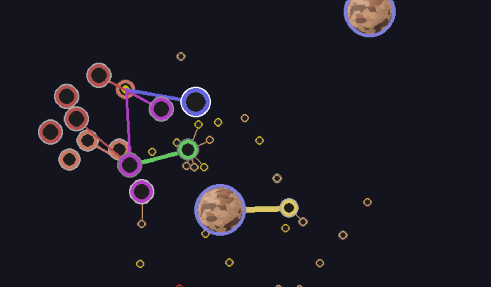

# Space Mining Robots
An AutoChess (Battler) where you compete with Space Mining Robots. This is a game about programming (Python) a set of 'bots' with simple behaviors and then just letting them go. It's a bit like Conway's game of life on zoomies (https://playgameoflife.com/). Anyway we just started.. hopefull will be kewl...
    
## Installation
```
pip install space_bots
```

## New Stuff
- Auto Annoucers: The current wave/match gets annouced automatically as part of the game. See the video below for an 'auto annouced' match. :)

## Help Wanted
- Looking for some pygame programmers to help out on the project to make it great!
- If interested please contact briford@supercowpowers.com

## Screen Shots


## Videos
The whole point of the game is to mine resources and protect the miner. The more Z-Nite (future mineral) you mine the more ships/upgrades you can make. To protect the miner you have a 'dungeon group' and yes classes matter.. a group of DPS would get wiped quickly.
- Healer = Green
- Tank = Blue
- DPS = Fuchsia
- Miner = Yellow

Remember that the action in the video below are Python Classes (robots) with simple behaviors, the action emerges organically from dropping the robots into the Universe and watching what happens.

**NOTE: Turn on Sound for the Auto Announcers!**


https://user-images.githubusercontent.com/4806709/186768241-fcf83559-4980-4977-8c05-31e7bdc52d23.mov

